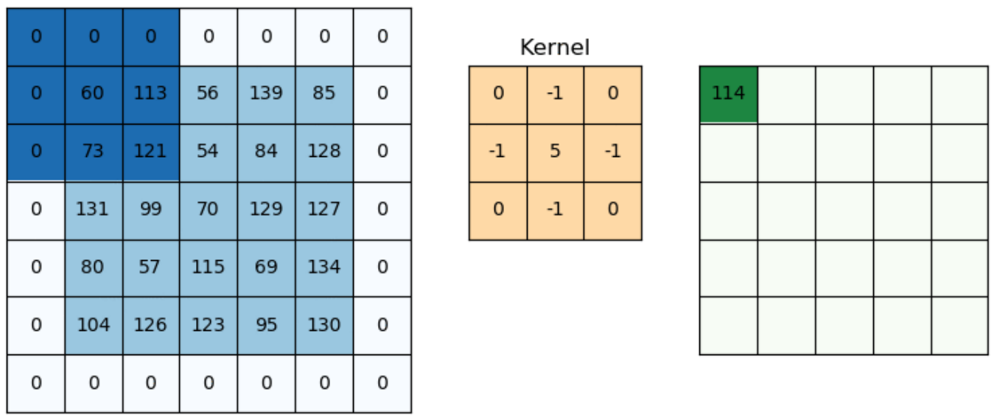

# <font color="red">Convoluzione</font>
L'applicazione di filtri prevede una semplice convoluzione stellare tra la maschera *(o kernel)* con l'immagine, il tutto avviene nel dominio dello spazio e concettualmente possiamo vederlo come una semplice mattonella *(solitamente 3x3)* che viene fatta scorrere su ogni singolo pixel tenendo conto del pixel centrale della maschera, tuttavia è sempre possibile cambiare il punto di origine con un pixel della maschera diverso da quello centrale.

## <font color="blue">Operazione effettuata dalla convoluzione</font>
Quando facciamo scorrere il kernel su ogni singolo pixel della immagine nella immagine di output quello specifico pixel avrà come nuovo valore la somma dei prodotti di ogni pixel del kernel per il corrispettivo pixel sull'immagine di input.



Nell'immagine di cui sopra è chiaro come il primo pixel alle coordinate `(0,0)` sia stato assegnato il valore `114` dovuto dal seguente calcolo:

$ 
0*0 + 0*(-1) + 0*0 + 0*(-1) + 60*5 + 113*(-1) + 0*0 + 73*(-1) + 121*0 =
$

$ 
= 0 + 0 + 0 + 0 + 300 - 113 + 0 - 73 + 0 = 300-113-73 = \color{red}114
$

Questo è il meccanismo generale di quando viene applicata la convoluzione stellare, dunque, cambiando i valori della matrice kernel è possibile ottenere svariate tipologie di effetti sull'immagine.ss

## <font color="blue">Filtri</font>
Vogliamo ora vedere alcuni di quelli che sono i filtri *(kernel)* più utilizzati

#### Filtro Media (Blurring)
| | | |
|---|---|---|
| 1 | 1 | 1 |
| 1 | 1 | 1 |
| 1 | 1 | 1 |

#### Filtro Prewitt (Vertical Edge Detection)
| | | |
|---|---|---|
| -1 | 0 | 1 |
| -1 | 0 | 1 |
| -1 | 0 | 1 |

#### Filtro Prewitt (Horizontal Edge Detection)
| | | |
|---|---|---|
| -1 | -1 | -1 |
| 0 | 0 | 0 |
| 1 | 1 | 1 |

#### Filtro Laplaciano invariante alle rotazioni di 90° (Edge Detection)
| | | |
|---|---|---|
| 0 | 1 | 0 |
| 1 | -4 | 1 |
| 0 | 1 | 0 |

#### Filtro Laplaciano invariante alle rotazioni di 45° (Blurring)
| | | |
|---|---|---|
| 1 | 1 | 1 |
| 1 | -8 | 1 |
| 1 | 1 | 1 |

#### Filtro di Sharpening (Nitidezza)
| | | |
|---|---|---|
| 0 | -1 | 0 |
| -1 | 5 | -1 |
| 0 | -1 | 0 |

#### Filtro di Sobel (Horizontal Edge Detection)
| | | |
|---|---|---|
| -1 | -2 | -1 |
| 0  | 0 | 0 |
| 1 | 2 | 1 |

#### Filtro di Sobel (Vertical Edge Detection)
| | | |
|---|---|---|
| -1 | 0 | 1 |
| -2  | 0 | 2 |
| -1 | 0 | 1 |

## <font color="blue">Operatori Gradiente</font>
Questa classe di filtri è utile ad individuare edge diagonali, quelli più semplici da utilizzare sono quelli di **Roberts**

#### Filtro di Roberts ($g_x$)
| | |
|---|---|
| -1 | 0 |
| 0  | 1 |

#### Filtro di Roberts ($g_y$)
| | |
|---|---|
| 0 | -1 |
| 1 | 0 |

Tuttavia, vi sono operatori sul gradiente anche basati su **Prewitt** e **Sobel**:

#### Filtro di Prewitt ($g_x$)
| | | |
|---|---|---|
| 0 | 1 | 1 |
| -1  | 0 | 1 |
| -1 | -1 | 0 |

#### Filtro di Prewitt ($g_y$)
| | | |
|---|---|---|
| -1 | -1 | 0 |
| -1  | 0 | 1 |
| 0 | 1 | 1 |

#### Filtro di Sobel ($g_x$)
| | | |
|---|---|---|
| 0 | 1 | 2 |
| -1  | 0 | 1 |
| -2 | -1 | 0 |

#### Filtro di Sobel ($g_y$)
| | | |
|---|---|---|
| -2 | -1 | 0 |
| -1  | 0 | 1 |
| 0 | 1 | 2 |

è possibile applicare filtri più complessi *(sempre basati sui gradienti)* come il famoso **LoG** *(Laplacian of Gaussian)* anche detto *operatore a sombrero*:

#### Filtro LoG
| | | | | |
|---|---|---|---|---|
| 0 | 0 | -1 | 0 | 0 |
| 0 | -1 | -2 | -1 | 0 |
| -1 | -2 | 16 | -2 | -1 |
| 0 | -1 | -2 | -1 | 0 |
| 0 | 0 | -1 | 0 | 0 |

## <font color="blue">Applicare i filtri con il metodo filter2D()</font>

Il metodo in questione ci permette di applicare un filtro 2D ad una immagine applicando una convoluzione stellare tra il kernel e l'immagine.
Il prototipo di questa funzione è:

```python
#filter2D prototype
import cv2
cv2.filter2D(src, ddepth, kernel, dst, anchor, delta, borderType)
```

Per quanto riguarda i parametri del metodo

* `src` &rarr; L'immagine sorgente a cui applicare il kernel.

* `ddepth` &rarr; La profondità dell'immagine di output, solitamente si setta a `-1` in modo che l'immagine di output possa avere la stessa profondità dell'immagine di input, con il termine profondità s'intende il tipo di dato della matrice immagine *(per esempio, "uint8")*.

* `kernel` &rarr; La maschera *(filtro)* che vogliamo applicare all'immagine.

* `dst` *(opzionale)* &rarr; La matrice in cui verrà contenuta l'immagine filtrata.

* `anchor` *(opzionale)* &rarr; Il punto dell'immagine in cui deve essere applicata la convoluzione con il filtro, solitamente si sceglie il punto centrale del kernel, ovvero settando tale valore con `(-1,-1)`

* `delta` *(opzionale)* &rarr; Un valore aggiuntivo che viene aggiunto successivamente alla convoluzione sulla immagine di input, modificare tale valore può comportare modifiche sulla luminostià dell'immagine risultante, di default `delta = 0`.

* `borderType` *(opzionale)* &rarr; La modalità con cui vengono gestiti i bordi durante la convoluzione.